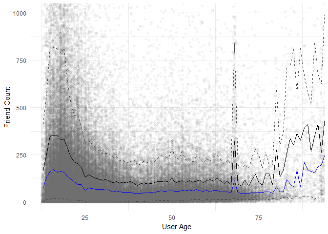
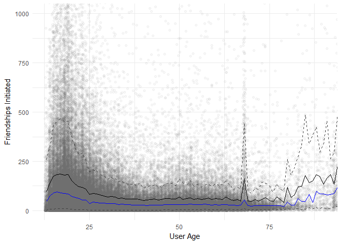

Example Exploration using Pseudo-Facebook Data
================

``` r
setwd('C:/Users/Shelby/Desktop/EDA/Psuedo Facebook')
library(ggplot2)
library(ggthemes)
pf <- read.csv('pseudo_facebook.tsv', sep = '\t')
```

This analysis uses simulated data.

Number of Friends vs. User Age
==============================

### Do younger users have more friends on Facebook?

Younger users often have thousands more friends than older users. There are some anomalous vertical bars at later ages, such as 69 or 100 that are likely younger users or fake accounts.

``` r
ggplot(aes(x = age, y = friend_count), data = pf) +
  geom_point() + 
  theme_minimal() +
  scale_y_continuous("Friend Count") +
  scale_x_continuous("User Age")
```


``` r
# summary statistics on user age
summary(pf$age)
```

    ##    Min. 1st Qu.  Median    Mean 3rd Qu.    Max. 
    ##   13.00   20.00   28.00   37.28   50.00  113.00

The minimum age required to join Facebook is 13, some users may actually be younger. Additionally, it seems unlikely that so many users are actually over 90 years old. Let's alter the limits on the x-axis, and address the overplotting (many points overlapping).

``` r
ggplot(aes(x = age, y = friend_count), data = pf) +
  # alpha = 1/20 makes points fainter
  # using jitter to add some noise to age, because in reality ages are not integers
  geom_jitter(alpha = 1/20) + 
  theme_minimal() +
  scale_y_continuous("Friend Count") +
  # add limits to the x-axis
  scale_x_continuous("User Age", limits = c(13, 90)) 
```

    ## Warning: Removed 5193 rows containing missing values (geom_point).


Can now see more clearly that the bulk of young users do not have thousands of friends. We still see the peak at 69, which looks similar to friend counts of users about 26 years in age.

We can use a transformation on friend count to better understand the distribution of friend count in relation to user age. The square-root transformation expands the scale below 1000 friends, where most of the data lies.

``` r
ggplot(aes(x = age, y = friend_count), data = pf) +
  # Because we are transforming the y-axis, need to add additional syntax
  # to specify the jitter should occur on the x-axis only.
  # (If we add noise to very small friend counts, we may end up with 
  # negative values, which would create imaginary numbers when the 
  # square-root transformation is applied.)
  geom_point(alpha = 1/20, position = position_jitter(w = 0.4, h = 0)) + 
  theme_minimal() +
  scale_y_continuous("Friend Count") +
  scale_x_continuous("User Age", limits = c(13, 90)) +
  # add a square-root transformation to the y-axis
  coord_trans(y = 'sqrt')
```

    ## Warning: Removed 5181 rows containing missing values (geom_point).


### Examining Mean and Median Friend Count by Age

``` r
library(dplyr)
```

    ## 
    ## Attaching package: 'dplyr'

    ## The following objects are masked from 'package:stats':
    ## 
    ##     filter, lag

    ## The following objects are masked from 'package:base':
    ## 
    ##     intersect, setdiff, setequal, union

``` r
# find mean and median friend count by age
pf.fc_by_age <- pf %>%
  group_by(age) %>%
  summarize(friend_count_mean = mean(friend_count),
            friend_count_median = median(friend_count),
            n = n()) %>%
  arrange(age)

head(pf.fc_by_age)
```

    ## # A tibble: 6 x 4
    ##     age friend_count_mean friend_count_median     n
    ##   <int>             <dbl>               <dbl> <int>
    ## 1    13               165                74.0   484
    ## 2    14               251               132    1925
    ## 3    15               348               161    2618
    ## 4    16               352               172    3086
    ## 5    17               350               156    3283
    ## 6    18               331               162    5196

``` r
# plot average friend count vs. age
ggplot(aes(x = age, y = friend_count_mean), data = pf.fc_by_age) +
  geom_line() +
  theme_minimal() +
  scale_y_continuous("Average Friend Count") +
  scale_x_continuous("User Age")
```

 Mean friend count peaks for users of age 16, and remains near 100 for users with ages 30 to 60 years. Above 60, the average friend count jumps around wildly, supporting our previous hypothesis that users with ages 69 or 90+ have not accurately represented their age.

### Overlay Raw Data with Summary

``` r
ggplot(aes(x = age, y = friend_count), data = pf) +
  geom_point(alpha = 1/20, 
             position = position_jitter(w = 0.4, h = 0),
             color = 'grey') + 
  theme_minimal() +
  scale_y_continuous("Friend Count") +
  scale_x_continuous("User Age") +
  # use coord_cartesian to limit the y-axis, it does not cut out data
  # This is necessary because we will be adding quantile lines to the plot
  # and we still want all data used in calculating mean, median, etc. 
  coord_cartesian(xlim = c(13, 90), ylim = c(0, 1000)) +
  # add a mean line
  geom_line(stat = 'summary', fun.y = mean) +
  # add 10% and 90% quantile lines
  geom_line(stat = 'summary', 
            fun.y = quantile,
            fun.args = list(probs = 0.1),
            linetype = 2, color = 'grey25') +
  geom_line(stat = 'summary',
            fun.y = quantile,
            fun.args = list(probs = 0.9),
            linetype = 2, color = 'grey25') +
  # add median
  geom_line(stat = 'summary',
            fun.y = quantile,
            fun.args = list(probs = 0.5),
            linetype = 1, color = 'blue') 
```



Having more than 1000 friends is quite rare. Even for ages where friend count peaks, less than 10% of users have more than 1000 friends. In the 30-60 age range, 90% of users have fewer than 250 friends.

Friendships Initiated vs. User Age
==================================

### Which age initiates the most friendships on Facebook?

``` r
ggplot(aes(x = age, y = friendships_initiated), data = pf) +
  geom_point(alpha = 1/20, position = position_jitter(w = 0.4, h = 0)) + 
  theme_minimal() +
  scale_y_continuous("Friendships Initiated") +
  scale_x_continuous("User Age", limits = c(13, 90)) +
  coord_trans(y = "sqrt")
```

    ## Warning: Removed 5189 rows containing missing values (geom_point).



The distribution is similar to friend count, but does not reach the same extremes. This makes sense because accross all users the sum of friend count will be twice that of total friendships initiated. In the former, each friendship is counted twice-once for each user in a friendship.

If we divide the sum of friend count by the sum of friendships initiated in this dataset, we find that the ratio is nearly 2.

``` r
sum(pf$friend_count)/sum(pf$friendships_initiated)
```

    ## [1] 1.827327
